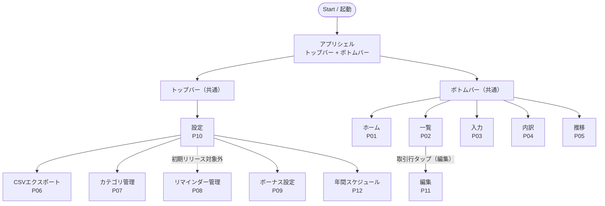

```mermaid
flowchart TD
  Start([Start / 起動]) --> Shell[アプリシェル<br/>トップバー + ボトムバー]

  %% Startから両バーへアクセス可能
  Shell --> Top[トップバー（共通）]
  Shell --> Bottom[ボトムバー（共通）]

  %% 01_画面リスト.csv: アクセス=ボトムバー
  Bottom --> P01[ホーム<br/>P01]
  Bottom --> P02[一覧<br/>P02]
  Bottom --> P03[入力<br/>P03]
  Bottom --> P04[内訳<br/>P04]
  Bottom --> P05[推移<br/>P05]

  %% 01_画面リスト.csv: アクセス=設定内
  P10 --> P06[CSVエクスポート<br/>P06]
  P10 --> P07[カテゴリ管理<br/>P07]
  P10 -. 初期リリース対象外 .-> P08[リマインダー管理<br/>P08]
  P10 --> P09[ボーナス設定<br/>P09]
  P10 --> P12[年間スケジュール<br/>P12]

  %% 編集画面（新規）
  P02 -->|取引行タップ（編集）| P11[編集<br/>P11]

  %% 任意: トップバーの共通アクション
  Top --> P10[設定<br/>P10]

```

> 注: P08（リマインダー管理 / F036）は初期リリース対象外。READMEで方針を管理する。
